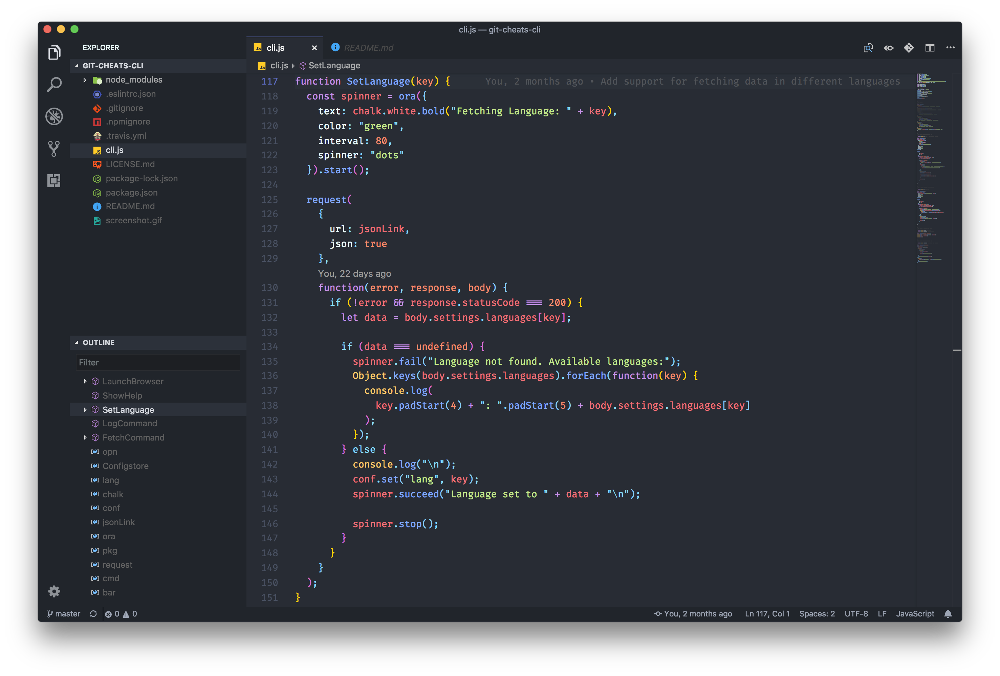

# Atomized Theme
[](https://marketplace.visualstudio.com/items?itemName=excalith.atomized-theme)
[](https://marketplace.visualstudio.com/items?itemName=excalith.atomized-theme)
[](https://marketplace.visualstudio.com/items?itemName=excalith.atomized-theme)

**Atomized Theme** is a combination of both **Atom**'s iconic theme and **Material Theme**'s syntax highlighting. A relief for sore eyes!



## Contribution
You are more than welcome to contribute the [Atomized Theme Repo](https://github.com/excalith/atomized-theme-vscode)

## Recommended Extensions
- [FiraCode Font](https://github.com/tonsky/FiraCode) - A monospaced font with ligatures for programming
- [Material Icon Theme](https://marketplace.visualstudio.com/items?itemName=pkief.material-icon-theme) - Minimal icon set for files
- [Bookmarks](https://marketplace.visualstudio.com/items?itemName=alefragnani.bookmarks) - Helps you to navigate through your code, moving between important positions easily and quickly.
- [GitLens](https://marketplace.visualstudio.com/items?itemName=eamodio.gitlens) - Visualizes valuable git related information within your code.
- [Todo Tree](https://marketplace.visualstudio.com/items?itemName=Gruntfuggly.todo-tree) - Searches your project for your tags like TODO and FIXME, and displays them in a tree view in the explorer pane. Can also highlight / colorize line as you want. Here is sample settings for it
```JSON
    "todo-tree.showInExplorer": false,
    "todo-tree.tags": [
        "TODO:",
        "FIXME:",
        "FIXED:",
        "HACK:"
    ],
    "todo-tree.defaultHighlight": {
        "type": "text"
    },
    "todo-tree.customHighlight": {
        "TODO:": {
            "icon": "check",
            "iconColour": "#ff8800",
            "foreground": "#ff8800"
        },
        "FIXED:": {
            "icon": "issue-closed",
            "iconColour": "#9251eb",
            "foreground": "#9251eb"
        },
        "FIXME:": {
            "icon": "issue-opened",
            "iconColour": "#c80000",
            "foreground": "#c80000"
        },
        "HACK:": {
            "icon": "terminal",
            "iconColour": "#00ff00",
            "foreground": "#00ff00"
        }
    }
```
- [Bracket Pair Colorizer](https://marketplace.visualstudio.com/items?itemName=CoenraadS.bracket-pair-colorizer) - Shows matching brackets to be identified with their own colours. Can also show matching pair in gutter which is nice.
```JSON
    "bracketPairColorizer.showBracketsInGutter": true,
    "bracketPairColorizer.showHorizontalScopeLine": false,
    "bracketPairColorizer.showVerticalScopeLine": false
```
